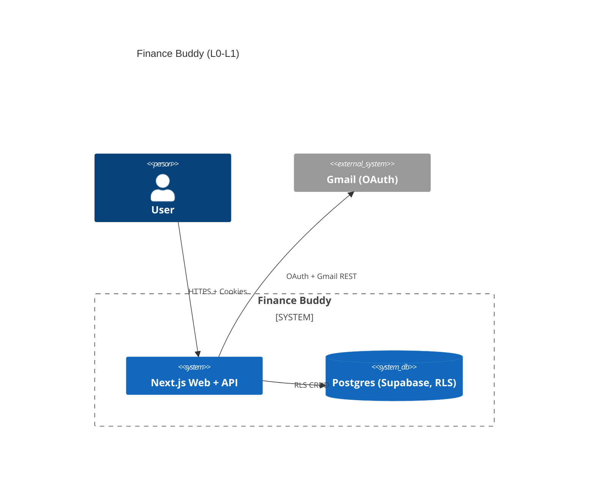
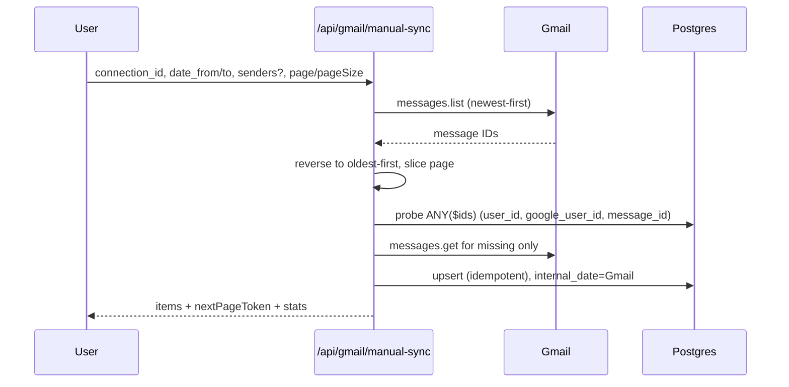

# AUGGIE_RUN_L1.md — Finance Buddy (L0–L1) Automation Script

> Optimized for **auggie-cli / augmentCode**: sequential, reproducible, **speared commits**, terminal-only operations.  
> This script bootstraps the repo and materializes the **five authoritative files** verbatim, then sets up generation & test scaffolds — **through L1 only**.

---

## Execution Profile

- Shell: **bash**
- Working directory: created as `./finance-buddy`
- Commit strategy: many **small, focused (speared)** commits
- Idempotent: safe to re-run; existing files are overwritten intentionally
- Scope lock: **L0 + L1 only** (stop at L1)

---

## Subfeatures & Commits Map (Speared)

**L0**
1. Repo skeleton & git init
2. Add five authoritative files (PRD, ADRs, Schema, OpenAPI, DB-UI Spec)
3. Env template & gitignore
4. Codegen scaffolding (DTOs + API stubs) — instructions only
5. Auth/cookies execution notes

**L1**
6. Manual Sync algorithm spec (pseudocode)  
7. Backfill orchestration spec (resumable jobs)  
8. DB Workbench guidance (owner-only)  
9. Diagrams (Mermaid)  
10. Test plan (contract + behavior)

---

## Runbook (copy-paste blocks in order)

### Commit 1 — Initialize repo & workspace

```bash
set -euo pipefail

# Fresh start
rm -rf finance-buddy
mkdir -p finance-buddy && cd finance-buddy
git init

# Monorepo skeleton
mkdir -p apps/web/src/pages/api apps/web/src/lib apps/web/src/middleware apps/web/test/api
mkdir -p packages/shared/src/dto packages/shared/src/types
mkdir -p infra/migrations infra/supabase/policies
mkdir -p openapi docs

# Base ignore
cat > .gitignore <<'EOF'
node_modules
.env
.env.*
.DS_Store
.next
coverage
dist
out
EOF

git add .
git commit -m "chore(repo): init monorepo skeleton"
```

---

### Commit 2 — Materialize the five authoritative files (verbatim)

```bash
# Schema (infra/migrations/0001_init.sql)
cat > infra/migrations/0001_init.sql <<'EOF'
-- finance-buddy-schema.sql (L1 Approved)
create extension if not exists pgcrypto;
-- Connections
create table if not exists fb_gmail_connections (
  id uuid primary key default gen_random_uuid(),
  user_id uuid not null references auth.users(id) on delete cascade,
  email_address text not null,
  google_user_id text not null,
  granted_scopes text[] not null,
  access_token text not null,
  refresh_token text not null,
  token_expiry timestamptz not null,
  token_type text,
  last_sync_at timestamptz,
  last_error text,
  created_at timestamptz not null default now(),
  updated_at timestamptz not null default now(),
  unique (user_id, email_address)
);

-- Emails
create table if not exists fb_emails (
  id uuid primary key default gen_random_uuid(),
  user_id uuid not null references auth.users(id) on delete cascade,
  google_user_id text not null,
  connection_id uuid references fb_gmail_connections(id) on delete set null,
  email_address text not null,
  message_id text not null,
  thread_id text not null,
  from_address text,
  to_addresses text[],
  subject text,
  snippet text,
  internal_date timestamptz,
  plain_body text,
  status text not null default 'Fetched' check (status in ('Fetched','Processed','Failed','Invalid')),
  error_reason text,
  processed_at timestamptz,
  created_at timestamptz not null default now(),
  updated_at timestamptz not null default now(),
  unique (user_id, google_user_id, message_id)
);
create index if not exists fb_emails_user_date_idx on fb_emails(user_id, internal_date desc);
create index if not exists fb_emails_user_google_date_idx on fb_emails(user_id, google_user_id, internal_date desc);

-- Extracted Transactions (placeholder for L2+)
create table if not exists fb_extracted_transactions (
  id uuid primary key default gen_random_uuid(),
  user_id uuid not null references auth.users(id) on delete cascade,
  google_user_id text not null,
  connection_id uuid references fb_gmail_connections(id) on delete set null,
  email_row_id uuid not null references fb_emails(id) on delete cascade,
  txn_time timestamptz,
  amount numeric(18,2),
  currency text,
  direction text check (direction in ('debit','credit')),
  merchant_name text,
  merchant_normalized text,
  category text,
  account_hint text,
  reference_id text,
  location text,
  confidence numeric(3,2),
  extraction_version text,
  created_at timestamptz not null default now(),
  updated_at timestamptz not null default now()
);
create index if not exists fb_txn_user_time_idx on fb_extracted_transactions(user_id, txn_time desc);
create index if not exists fb_txn_user_google_time_idx on fb_extracted_transactions(user_id, google_user_id, txn_time desc);

-- Jobs (backfill)
create table if not exists fb_jobs (
  id uuid primary key default gen_random_uuid(),
  user_id uuid not null references auth.users(id) on delete cascade,
  type text not null, -- 'backfill'
  payload jsonb not null,
  status text not null default 'queued',
  attempts int not null default 0,
  last_error text,
  created_at timestamptz not null default now(),
  updated_at timestamptz not null default now()
);

-- RLS
alter table fb_gmail_connections enable row level security;
alter table fb_emails enable row level security;
alter table fb_extracted_transactions enable row level security;
alter table fb_jobs enable row level security;

create policy "own connections" on fb_gmail_connections for all using (user_id = auth.uid()) with check (user_id = auth.uid());
create policy "own emails"       on fb_emails            for all using (user_id = auth.uid()) with check (user_id = auth.uid());
create policy "own txns"         on fb_extracted_transactions for all using (user_id = auth.uid()) with check (user_id = auth.uid());
create policy "own jobs"         on fb_jobs             for all using (user_id = auth.uid()) with check (user_id = auth.uid());
EOF

# ADRs
cat > docs/Finance-Buddy-ADRs.md <<'EOF'
# Finance Buddy — ADRs

## ADR-01: Supabase Auth with secure cookies
Accepted. Dual-cookie with 6‑month sliding refresh.

## ADR-02: Gmail OAuth-only
Accepted. Store tokens + granted scopes; PKCE; HTTPS only.

## ADR-03: Manual Sync Only
Accepted. No watch/history/polling. Use messages.list + messages.get.

## ADR-04: Idempotency Key
Accepted. UNIQUE (user_id, google_user_id, message_id) on fb_emails.

## ADR-05: internal_date Fidelity
Accepted. internal_date = Gmail internalDate (ms→UTC).

## ADR-06: Hard Delete Connections
Accepted. On disconnect: revoke token then DELETE connection; emails/txns persist, FKs set NULL.

## ADR-07: RLS
Accepted. All fb_ tables enforce user_id = auth.uid().
EOF

# PRD + Tech Notes
cat > docs/Finance-Buddy-PRD-Tech.md <<'EOF'
Approved Scope: through L1

# Finance Buddy — PRD + Tech Design

## TL;DR
Finance Buddy connects multiple Gmail accounts via OAuth, lets the user run **manual syncs** over date ranges (with optional sender filters and paging), stores emails with strict idempotency, and provides read/search APIs and DB workbenches. Connections are **hard-deleted** on revoke; data persists. RLS protects all user data.

## Problem & Goals
- Automate collecting financial emails.
- Keep setup simple and device-agnostic.
- Ensure no duplicates across disconnect → reconnect flows.

## Non-Goals (now)
- Gmail push watch/history/polling.
- Device binding, MFA.
- Writing any application code in this builder.

## Architecture Overview
- Frontend: Next.js 15, React 19, TS, Tailwind.
- Backend: Next.js API routes (Node/TS).
- Auth: Supabase Auth (email/password), cookies `Secure` + `HttpOnly`, 6‑month sliding refresh.
- DB: Postgres (Supabase) with RLS.
- Gmail: OAuth-only; `messages.list` + `messages.get`.



## Data Model (summary)
- `fb_gmail_connections`: tokens, scopes, `google_user_id`, `email_address`. **Hard-delete on disconnect**.
- `fb_emails`: unique per `(user_id, google_user_id, message_id)`. `internal_date` from Gmail `internalDate` (ms→UTC). `connection_id` nullable `ON DELETE SET NULL`.
- `fb_extracted_transactions`: structured rows per email (kept for future phases), includes `google_user_id`.

## Phase L0 (Approved)
- Auth & Sessions
- DB schema & RLS

## Phase L1 (Approved)
- L1.1 OAuth connect/callback & storage (PKCE; store tokens, scopes, `google_user_id`).
- L1.2 Manual Sync API (date range + senders + paging; default **oldest→newest**; DB probe → get missing → upsert).
- L1.3 Manual Backfill wrapper (orchestrates L1.2 in chunks; resumable).
- L1.4 Disconnect/Revoke (hard delete connection) & Health.
- L1.5 Read APIs (emails & transactions).

### Manual Sync Sequence


## APIs (summary)
See `finance-buddy-openapi.yaml` for full shapes.

## Acceptance Criteria (L1)
- No duplicates across disconnect → reconnect.
- `internal_date` fidelity.
- Read APIs filter & paginate correctly; default asc order.

## Security & Performance
- RLS on all `fb_` tables.
- Single probe query per page using `ANY($ids)`.
- Indexes for `(user_id, google_user_id, message_id)` and time-based listing.

## Rollout Plan
1) Apply schema.
2) Enable OAuth credentials.
3) Test manual sync idempotency & ordering.
4) Ship `/db` workbenches for owner-only.
EOF

# DB UI Spec
cat > docs/Finance-Buddy-DB-UI-Spec.md <<'EOF'
# Finance Buddy — DB UI Spec

## Routes
- /db/fb_emails — Email workbench
- /db/fb_extracted_transactions — Transaction review workbench

## Emails Workbench
- Grid columns: internal_date, from_address, subject, status, email_address
- Filters: date range, account, sender, status, q
- Actions: Re-Extract (stub), Mark Invalid, Set Fetched, Redact body
- Drawer: headers + body (read-only by default), error_reason, processed_at

## Transactions Workbench
- Grid columns: txn_time, amount, currency, direction, merchant, category, confidence, review_state
- Filters: date range, account, direction, category prefix, merchant q, min_confidence, review_state
- Actions: Approve, Reject, Set Category, Set Merchant, Re-extract (stub)
- Drawer: editable form + source email snapshot

## Validation
- Transactions: amount ≥ 0; currency ISO; direction in {debit, credit}; txn_time valid ISO.
- Emails: status transitions—Processed read-only (except via extractor); Invalid↔Fetched; Failed→Fetched.

## Implementation Brief
- Server paging; default sort **asc** by internal_date / txn_time.
- Optimistic UI optional via updated_at.
- Endpoints used: /api/emails/search, PATCH /api/emails/{id}, POST /api/emails/bulk; same pattern for transactions.
EOF

# OpenAPI
cat > openapi/finance-buddy-openapi.yaml <<'EOF'
openapi: 3.1.0
info:
  title: Finance Buddy API
  version: 1.0.0
servers:
  - url: https://api.finance-buddy.example.com
paths:
  /api/gmail/connect:
    get:
      summary: Start Gmail OAuth (PKCE)
      responses: { '302': { description: Redirect } }
  /api/gmail/callback:
    get:
      summary: Gmail OAuth callback
      responses: { '302': { description: Redirect } }
  /api/gmail/connections:
    get:
      summary: List Gmail connections
      responses: { '200': { description: OK } }
  /api/gmail/disconnect:
    post:
      summary: Revoke token and hard-delete the connection
      requestBody:
        required: true
        content:
          application/json:
            schema:
              type: object
              required: [connection_id]
              properties:
                connection_id: { type: string, format: uuid }
                revoke: { type: boolean, default: true }
      responses: { '204': { description: No Content } }
  /api/gmail/manual-sync:
    post:
      summary: Manual sync (date range + senders + paging; oldest→newest)
      requestBody:
        required: true
        content:
          application/json:
            schema:
              type: object
              required: [connection_id, date_from, date_to]
              properties:
                connection_id: { type: string, format: uuid }
                date_from: { type: string, format: date }
                date_to: { type: string, format: date }
                senders:
                  type: array
                  items: { type: string }
                page: { type: integer, default: 1, minimum: 1 }
                pageSize: { type: integer, default: 50, maximum: 100 }
                sort: { type: string, enum: [asc, desc], default: asc }
      responses:
        '200': { description: OK }
  /api/gmail/backfill:
    post:
      summary: Orchestrate manual sync across chunks (resumable)
      responses: { '202': { description: Accepted } }
  /api/emails/search:
    post:
      summary: Search stored emails
      responses: { '200': { description: OK } }
  /api/transactions/search:
    post:
      summary: Search extracted transactions
      responses: { '200': { description: OK } }
EOF

git add infra/migrations/0001_init.sql docs/*.md openapi/finance-buddy-openapi.yaml
git commit -m "docs(core): add PRD, ADRs, DB-UI; feat(db): initial schema; feat(api): OpenAPI contract"
```

---

### Commit 3 — Environment templates

```bash
cat > .env.example <<'EOF'
NEXT_PUBLIC_SUPABASE_URL=
SUPABASE_SERVICE_ROLE_KEY=
GMAIL_CLIENT_ID=
GMAIL_CLIENT_SECRET=
NEXTAUTH_URL=
COOKIE_NAME=fb_session
EOF

git add .env.example
git commit -m "chore(env): add example env vars (Supabase, Gmail OAuth, cookies)"
```

---

### Commit 4 — Codegen instructions (DTOs & route stubs)

```bash
cat > docs/GENERATION_GUIDE.md <<'EOF'
# Generation Guide

1) Generate TypeScript DTOs from `openapi/finance-buddy-openapi.yaml` into:
   - `packages/shared/src/dto/`

2) Generate API route handlers (empty stubs) into:
   - `apps/web/src/pages/api/` matching OpenAPI paths

3) Ensure default field values & status codes match OpenAPI.

4) Do not implement business logic in stubs. Logic lands in later commits.
EOF

git add docs/GENERATION_GUIDE.md
git commit -m "docs(gen): add DTO and API stub generation guide"
```

---

### Commit 5 — Auth & cookie execution notes

```bash
cat > docs/AUTH_NOTES.md <<'EOF'
# Auth & Cookies — Execution Notes
- Supabase Auth only; HTTPS enforced.
- Secure + HttpOnly cookies with 6-month sliding refresh.
- Gmail is OAuth-only for data access; app login remains Supabase-based.
EOF

git add docs/AUTH_NOTES.md
git commit -m "docs(auth): execution notes for Supabase auth and secure cookies"
```

---

### Commit 6 — Manual Sync algorithm (L1 pseudocode)

```bash
cat > docs/ALGO_MANUAL_SYNC.md <<'EOF'
# Manual Sync — Pseudocode (L1)

Input: connection_id, date_from, date_to, senders?, page, pageSize (default 50), sort=asc

1) Gmail `messages.list` (Google default newest-first) with date range + from filter (if provided).
2) Reverse list to oldest-first; slice for page.
3) Probe DB:
   SELECT message_id
   FROM fb_emails
   WHERE user_id=$uid
     AND google_user_id=$gid
     AND message_id = ANY($ids);
4) Fetch missing via `messages.get` only for IDs not present.
5) Upsert into `fb_emails` with unique (user_id, google_user_id, message_id).
   - `internal_date` = Gmail `internalDate` (ms) converted to UTC timestamptz.
   - `status` default 'Fetched'.
6) Return items (asc), nextPageToken (if more), stats {probed, fetched, upserts}.
EOF

git add docs/ALGO_MANUAL_SYNC.md
git commit -m "docs(sync): add L1 manual sync algorithm pseudocode"
```

---

### Commit 7 — Backfill orchestration (resumable)

```bash
cat > docs/ALGO_BACKFILL.md <<'EOF'
# Backfill Orchestration — L1

- Split requested date range into chunks (e.g., per day/week).
- Insert `fb_jobs` row with payload {connection_id, ranges, cursor}.
- Iterate ranges:
  - call manual-sync for the chunk
  - update job cursor/progress
- Retries: increment attempts; retain last_error.
- Status: Pending -> Running -> Completed | Failed.
EOF

git add docs/ALGO_BACKFILL.md
git commit -m "docs(backfill): add resumable backfill orchestration notes"
```

---

### Commit 8 — DB Workbench guidance (owner-only)

```bash
cat > docs/WORKBENCH_NOTES.md <<'EOF'
# DB Workbenches (Owner-only)

/db/fb_emails
- Columns: internal_date, from_address, subject, status, email_address
- Filters: date range, account, sender, status, q
- Actions: Re-Extract (stub), Mark Invalid, Set Fetched, Redact body
- Default sort: internal_date asc

/db/fb_extracted_transactions
- Columns: txn_time, amount, currency, merchant, category, status
- Filters: date range, account, merchant, category, amount range, status
- Actions: Re-Extract (stub), Re-Categorize (stub)
- Default sort: txn_time asc
EOF

git add docs/WORKBENCH_NOTES.md
git commit -m "docs(workbench): guidance for emails and transactions grids"
```

---

### Commit 9 — Diagrams (Mermaid)

```bash
cat > docs/DIAGRAMS.md <<'EOF'
# Diagrams

## Context


## Manual Sync Sequence

EOF

git add docs/DIAGRAMS.md
git commit -m "docs(diagrams): add context and manual-sync sequence diagrams"
```

---

### Commit 10 — Test plan (contract + behavior)

```bash
cat > docs/TEST_PLAN.md <<'EOF'
# Test Plan (L1)

## Contract Tests
- Validate all routes conform to OpenAPI (status codes, shapes).

## Behavior Tests
- OAuth connect/callback persists tokens, scopes, google_user_id, email_address.
- Idempotency: resync same message IDs -> no duplicates.
- internal_date fidelity: saved == Gmail internalDate (ms→UTC).
- Default ordering: asc for manual-sync output and searches.
- Disconnect: token revoked, connection deleted; emails/txns persist (FKs nullable).
- RLS: user can access only their rows across all fb_ tables.
EOF

git add docs/TEST_PLAN.md
git commit -m "test(plan): define contract & behavior tests for L1"
```

---

## Post-Run Automation (for Auggie/augmentCode)

1. Read the **five authoritative files** and treat them as source of truth.  
2. Generate DTOs and API stubs from OpenAPI into `packages/shared/src/dto/` and `apps/web/src/pages/api/`.  
3. Apply `infra/migrations/0001_init.sql` to Postgres/Supabase.  
4. Implement logic per algorithms and ADRs; enforce RLS; default ordering asc.  
5. Implement owner-only workbench endpoints/queries per DB-UI Spec.  
6. Generate contract tests (OpenAPI) + behavior tests (TEST_PLAN.md).

---

## End of Script
