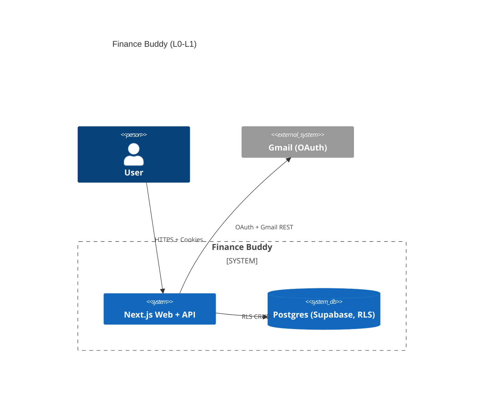
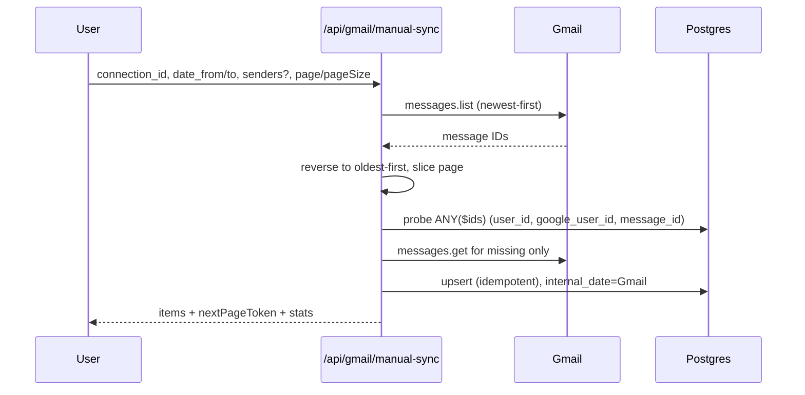

# Diagrams

## Context

```mermaid
C4Context
title Finance Buddy (L0-L1)
Person(user, "User")
System_Boundary(app, "Finance Buddy") {
  System(web, "Next.js Web + API")
  SystemDb(db, "Postgres (Supabase, RLS)")
}
System_Ext(google, "Gmail (OAuth)")
Rel(user, web, "HTTPS + Cookies")
Rel(web, google, "OAuth + Gmail REST")
Rel(web, db, "RLS CRUD")
```

## Manual Sync Sequence

```mermaid
sequenceDiagram
  participant U as User
  participant API as /api/gmail/manual-sync
  participant G as Gmail
  participant DB as Postgres
  U->>API: connection_id, date_from/to, senders?, page/pageSize
  API->>G: messages.list (newest-first)
  G-->>API: message IDs
  API->>API: reverse to oldest-first, slice page
  API->>DB: probe ANY($ids) (user_id, google_user_id, message_id)
  API->>G: messages.get for missing only
  API->>DB: upsert (idempotent), internal_date=Gmail
  API-->>U: items + nextPageToken + stats
```
