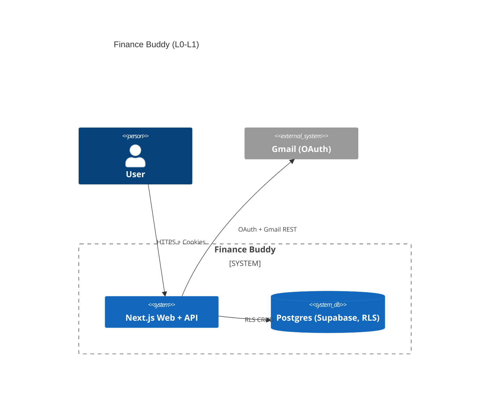
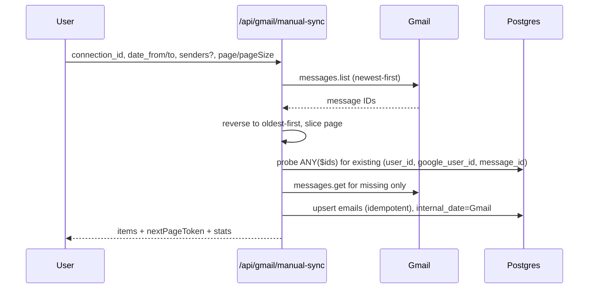

Approved Scope: through L1

# Finance Buddy — PRD + Tech Design

## TL;DR
Finance Buddy connects multiple Gmail accounts via OAuth, lets the user run **manual syncs** over date ranges (with optional sender filters and paging), stores emails with strict idempotency, and provides read/search APIs and DB workbenches. Connections are **hard-deleted** on revoke; data persists. RLS protects all user data.

## Problem & Goals
- Automate collecting financial emails.
- Keep setup simple and device-agnostic.
- Ensure no duplicates across disconnect → reconnect flows.

## Non-Goals (now)
- Gmail push watch/history/polling.
- Device binding, MFA.
- Writing any application code in this builder.

## Architecture Overview
- Frontend: Next.js 15, React 19, TS, Tailwind.
- Backend: Next.js API routes (Node/TS).
- Auth: Supabase Auth (email/password), cookies `Secure` + `HttpOnly`, 6‑month sliding refresh.
- DB: Postgres (Supabase) with RLS.
- Gmail: OAuth-only; `messages.list` + `messages.get`.

## Data Model (summary)
- `fb_gmail_connections`: tokens, scopes, `google_user_id`, `email_address`. **Hard-delete on disconnect**.
- `fb_emails`: unique per `(user_id, google_user_id, message_id)`. `internal_date` from Gmail `internalDate` (ms→UTC). `connection_id` nullable `ON DELETE SET NULL`.
- `fb_extracted_transactions`: structured rows per email (kept for future phases), includes `google_user_id`.

## Phase L0 (Approved)
- Auth & Sessions
- DB schema & RLS

## Phase L1 (Approved)
- L1.1 OAuth connect/callback & storage (PKCE; store tokens, scopes, `google_user_id`).
- L1.2 Manual Sync API (date range + senders + paging; default **oldest→newest**; DB probe → get missing → upsert).
- L1.3 Manual Backfill wrapper (orchestrates L1.2 in chunks; resumable).
- L1.4 Disconnect/Revoke (hard delete connection) & Health.
- L1.5 Read APIs (emails & transactions).

### Manual Sync Sequence

## APIs (summary)
See `finance-buddy-openapi.yaml` for full shapes.

## Acceptance Criteria (L1)
- No duplicates across disconnect → reconnect.
- `internal_date` fidelity.
- Read APIs filter & paginate correctly; default asc order.

## Security & Performance
- RLS on all `fb_` tables.
- Single probe query per page using `ANY($ids)`.
- Indexes for `(user_id, google_user_id, message_id)` and time-based listing.

## Rollout Plan
1) Apply schema.
2) Enable OAuth credentials.
3) Test manual sync idempotency & ordering.
4) Ship `/db` workbenches for owner-only.
