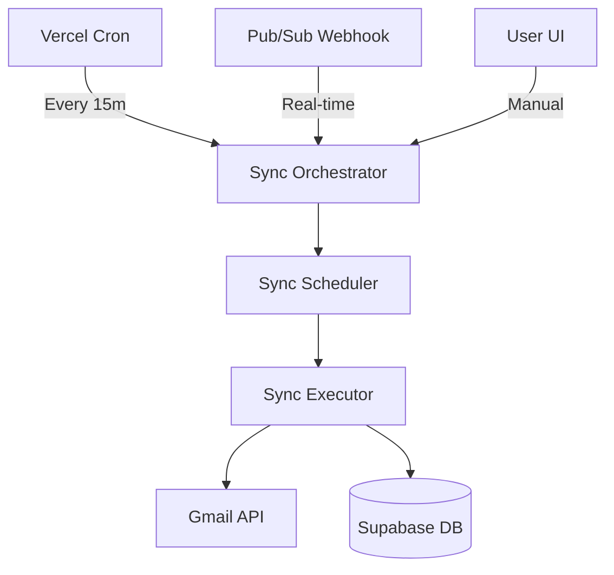

# Gmail Synchronization Guide

Finance Buddy provides a robust system for synchronizing financial emails from Gmail. This document covers the architecture, configuration, and operation of both on-demand and automatic synchronization.

## Table of Contents
1. [Overview](#overview)
2. [Synchronization Methods](#synchronization-methods)
3. [Architecture](#architecture)
4. [Email Filters](#email-filters)
5. [Auto-Sync Configuration](#auto-sync-configuration)
6. [Security & Scopes](#security--scopes)
7. [Error Handling & Retries](#error-handling--retries)

---

## Overview

The synchronization system is designed to:
- **Minimize API overhead** by using selective filters.
- **Ensure reliability** through a hybrid of scheduled polling and push notifications.
- **Maintain data integrity** with robust deduplication.

---

## Synchronization Methods

### 1. Manual Sync
Triggered by the user via the UI.
- **Backfill**: Syncs historical data (up to 30 days by default).
- **On-Demand**: Fetches messages matching the current search criteria.

### 2. Auto-Sync (Polling)
A background process that runs every 5-15 minutes (configurable).
- **Trigger**: Vercel Cron Job calling `/api/cron/gmail-auto-sync`.
- **Scope**: Processes all active connections with `auto_sync_enabled=true`.

### 3. Push Notifications (Real-time)
Uses Google Cloud Pub/Sub to trigger immediate sync when new mail arrives.
- **Trigger**: Webhook at `/api/gmail/webhook`.
- **Latency**: Typically < 30 seconds.

---

## Architecture

### System Flow

### Module Structure
- `src/lib/gmail-auto-sync/`: Main logic directory.
- `filter-manager.ts`: Core CRUD for sync filters.
- `sync-executor.ts`: Handles the heavy lifting of fetching and storing emails.
- `query-builder.ts`: Transforms user filters into Gmail query strings.

---

## Email Filters

Filters determine which emails are automatically brought into Finance Buddy.

| Filter Type | Example | Gmail Query String |
| :--- | :--- | :--- |
| **Sender** | `statements@bank.com` | `from:statements@bank.com` |
| **Subject** | `Invoice` | `subject:Invoice` |
| **Label** | `Financial` | `label:Financial` |
| **Custom** | `has:attachment` | `has:attachment` |

---

## Auto-Sync Configuration

### Setup Steps
1. **Connect Account**: Link Gmail via OAuth in the Admin Dashboard.
2. **Define Filters**: Create specific filters for banking or invoice senders.
3. **Enable Auto-Sync**: Toggle the "Auto-Sync" switch for the connection.
4. **Interval**: Set the polling frequency (default 15m).

### Monitoring
The **Admin Dashboard** provides real-time stats:
- **Total Emails Synced**
- **Last Sync Timestamp**
- **Pending/Error States**

---

## Security & Scopes

### Required Gmail Scopes
- `https://www.googleapis.com/auth/gmail.readonly`: To read email metadata and bodies.
- `https://www.googleapis.com/auth/gmail.labels`: To manage and read labels for filtering.

### Data Protection
- **OAuth Tokens**: Stored encrypted in Supabase.
- **RLS**: Row-Level Security ensures users only see emails from their own connections.

---

## Error Handling & Retries

### Transient Errors
The system uses **Exponential Backoff** for:
- API Rate Limiting (429)
- Network Timeout

### Permanent Errors
Connections are marked as `error` if:
- Refresh token is revoked.
- Scopes are missing.
- Persistent 401/403 errors occur.

---

## Troubleshooting

- **Sync not running?** Check if `CRON_SECRET` is set in environment variables.
- **Missing emails?** Ensure the Gmail query matches the expected sender exactly.
- **Token expired?** Most tokens refresh automatically. If they fail, re-authenticate in the Admin Dashboard.
